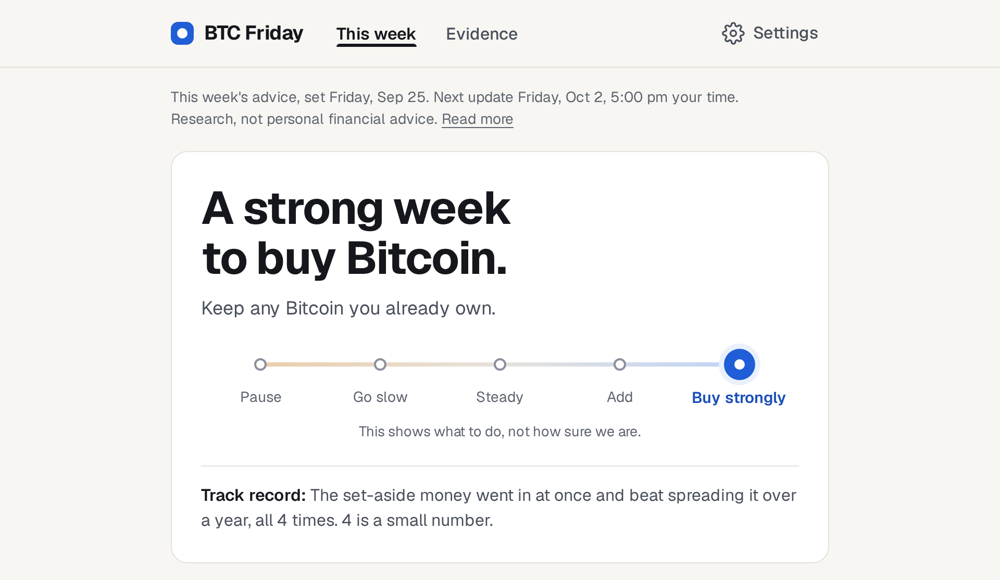

# BTC Friday

[](https://btcfriday.app)

A weekly page that tells a Bitcoin holder what to do with new money, by when, and what the record behind that call is.

The live site is [btcfriday.app](https://btcfriday.app). The picture is This week for the close of 25 September 2026. This repository is the pages, the Friday record, and the job that publishes them.

## What's on the site

**This week** is the home page. One step is marked on a scale of five: Pause, Go slow, Steady, Add, or Buy strongly. The page then says what to do, why, whether a week like this has worked before, and what could go wrong. The Bitcoin price can update between Fridays. The official call changes on the Friday close.

**Evidence** (`/evidence/`) is the page behind the advice. It is the darker dashboard: the rule for this week, the price chart back to 2013, how early past signals were, and a glossary.

**Settings** stay on the device. The amounts you enter, and the kind of account you hold, are saved in the browser.

BTC Friday is research, not personal financial advice. It does not place orders or calculate taxes.

## Working on it

The browser reads `/data/friday.json` and `/data/live.json`. A Node job on the host writes those files. The pages are static HTML filled in from that JSON.

```bash
npm test
npm run typecheck
npm run build
```

`npm test` runs the Node test runner on `test/**/*.test.ts`. `npm run typecheck` runs `tsc --noEmit`. `npm run build` runs `scripts/build.mjs`.

- [How the pages and the job are built](docs/12-tech-stack-approach.md), including the [work log](docs/12-tech-stack-approach.md#work-log)
- [What the Friday page is for](docs/7-friday-wireframe.md)
- [How This week was revised](docs/17-human-first-implementation-plan.md)
- [How a deploy works](docs/deploy.md)
