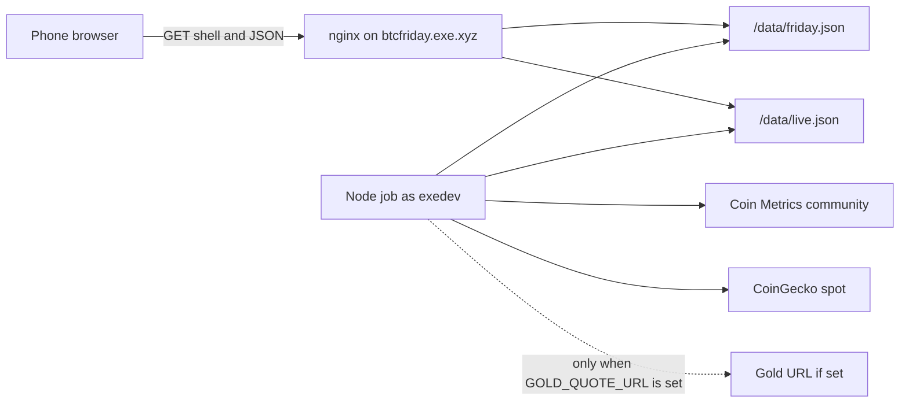

# Dashboard implementation plan

> **For agentic workers:** Execute this file with `/execute-plan docs/13-implementation-plan.md`. The `## PR Plan` at the end is the DAG that skill parses. Implement one pull request at a time, from the sections named in that pull request. Do not implement the dashboard in the same change that adds this file. Before each pull request, follow the Work log in `docs/12-tech-stack-approach.md`: one issue at <https://github.com/rkalla/btc-insights/issues> for that pull request, opened first, closed with `Fixes #N`. Review fixes stay on that issue.

**Status:** Ready to execute. 26 September 2026.

**Goal:** Ship the locked Bitcoin dashboard as a static page plus one scheduled job: official guidance changes at the Friday close, levels that are allowed to move refresh from a shared cache about every 10 minutes, and the phone never calls a market API.

**Spec:** Signal rules are `docs/2-signal-strategy.md`. Page words are `docs/7-friday-wireframe.md`. Look, layout, and states are `docs/9-claude-design-specification.pdf`, built to match `docs/10-claude-design-reference.html` and `docs/11-claude-design-settings.html`. The production stack is `docs/12-tech-stack-approach.md`. Deploys follow `docs/deploy.md`. The quality table and the published numbers are `docs/1-signal-quality.md`. The goal is `docs/goal.md`.

## Authority

When sources disagree, use this order:

1. `docs/7-friday-wireframe.md` for every sentence the page may show, and for when a region is absent.
2. `docs/9-claude-design-specification.pdf` for look, layout, states, and accessibility.
3. `docs/10-claude-design-reference.html` and `docs/11-claude-design-settings.html` for class names, tokens, and the sample markup.
4. `docs/12-tech-stack-approach.md` where it is the later decision: no React, no `d3`, no charting library, self-hosted fonts, two JSON files, a 10-minute shared cache, and a JavaScript job. Those override the design spec's React suggestion, its `d3` option, its Google Fonts default, and the line that the page is read once a week.
5. `docs/2-signal-strategy.md` for how a posture is chosen. The painter does not choose it.

`docs/mockups/friday-wireframe.png` is an earlier picture. It has no spectrum strip and no system states. Do not match it.

These design-spec questions are already settled. Do not reopen them in code:

| Question in the design spec | Decision |
| --- | --- |
| Phone order | Under 768 px: header, clock sentence, Cash, Coins, Now, spectrum, then the rest. |
| Spectrum strip | On the page. It is not a confidence scale. |
| Loading, stale, missing-close, no-data, blank amount, Show fires | Adopted as written in the wireframe's System states section. |
| Exit | Cash word "No new buy". No active cash segment. |
| Where settings live | This browser only. No account, no server copy. |
| Posture-change alert | Not in this plan. |

## Goals and non-goals

**In this plan**

- The dashboard and the Settings page, matching the reference at the sample fill and obeying blank-settings rules.
- The four system states, marker detail, and the phone fires sheet.
- Device-local settings, Trim, and Exit.
- `friday.json` and `live.json` contracts, a Friday builder, and a live-slice function.
- A Node job that is the only caller of upstream APIs, with fail-closed vendors.
- Tests for the published record, the posture order, the holder rules, and the rule that a live print does not move the official call.
- A deploy script and systemd unit files. Running them against the VM is not part of any pull request.

**Not in this plan**

- The six studies in `docs/2-signal-strategy.md` under "Next tests" (arm-to-fire in coins, the full posture backtest, the 2015 five-Friday replay, a new arm, macro liquidity, volatility-scaled bands).
- Choosing a gold vendor, or replacing the study z-score with a new gold feed.
- Re-dating the published buy-cross or sell-roll fires.
- Alerts, login, settings sync, a broker, a tax rate, Docker, a React app, a charting library, or any signal the wireframe lists under "Not on this wireframe".
- Editing `docs/goal.md`, `docs/1-signal-quality.md`, `docs/2-signal-strategy.md`, `docs/3-confirmation-plan.md`, `docs/4-confirmation-findings.md`, or the design PDF and the two reference HTML files. Those stay the spec. Production code is new.

## Key decisions

1. **Two programs, one page.** `src/painter` and `src/client` draw a view model. `src/job` writes the two JSON files. The painter does not fit the power law, score the official z, or choose the cash posture.
2. **Sentences are data.** Cash and context sentences are the wireframe's words, stored in `src/job/copy.ts` and covered by exact string tests. The client may change only the dollar clause, the coin line, the countdown, chart scales, and the fields the live slice is allowed to replace.
3. **Published fires stay the record.** The study fire dates, the 0% and 24.5% gold shares, and the finished cycle rows are checked-in facts. A new gold series may drive the official z only after `officialFeedMatchesPublished` returns true (same zero-cross Fridays). Until then the job keeps the study sentences and does not invent a fire.
4. **The 25 September 2026 progress card is the wireframe's card** when spot is $84,413. A different spot is recomputed. Do not "correct" +208% to a formula that rounds to +207%.
5. **Blank settings name the pile.** The only dashboard dollar swap in this plan is the All-in clause: "Up to $100,000." becomes "Use your cash available to invest." No other posture gains a dollar the wireframe did not print.
6. **Fail closed on the network.** A rate limit or a missing gold URL keeps the last good print. The job does not retry in a loop and does not pick a substitute host.
7. **The page bundle never contains a market hostname.** CoinGecko and Coin Metrics are job code only.
8. **One GitHub issue per reviewable slice.** The rule is the Work log in `docs/12-tech-stack-approach.md`. This plan's twelve pull requests are twelve issues. Files, tests, and review fixes inside a pull request do not get their own issues.

## Architecture



The phone loads `index.html`, CSS, JS, and the two JSON files. It refetches `live.json` only while the tab is visible, at most every 10 minutes. When `live.officialCloseDate` differs from the Friday document already loaded, it fetches `friday.json` again with `cache: "no-store"`. A hidden tab does not poll. Settings never leave the device. Trim and Exit are applied after the fetch, from local settings plus the latest spot.

nginx already sends `Cache-Control: public, max-age=86400` for `/data/friday.json` and `max-age=60` for `/data/live.json`. Do not add a CDN, a content-addressed Friday URL, or a websocket.

## File map

| Path | Responsibility |
| --- | --- |
| `package.json`, `tsconfig.json`, `scripts/build.mjs` | Node 24, TypeScript, esbuild. No React, no d3. |
| `src/contract/types.ts` | `FridayDocument`, `LiveSlice`, `HolderSettings`, `DashboardVM`. |
| `src/contract/format.ts` | Money, signed percent with U+2212, dates. Used by the job and by chart ticks. |
| `src/settings/validate.ts`, `src/settings/store.ts`, `src/settings/holder.ts` | Browser settings, Trim, Exit, the dollar clause. |
| `src/compose/view-model.ts` | Merges Friday, live, and settings. Applies system states. |
| `src/painter/chart.ts` | Log-price SVG from the view model. Plain math. |
| `src/painter/dashboard.ts`, `src/painter/settings.ts`, `src/painter/icons.ts` | HTML using the reference class names. |
| `src/painter/dashboard.css` | Tokens and layout from the reference, with self-hosted fonts. |
| `src/client/dashboard.ts`, `src/client/settings.ts` | Fetch, poll, popover, sheet, save. |
| `public/fonts/` | Latin woff2 for Geist and Geist Mono. |
| `src/job/copy.ts` | Exact posture sentences. |
| `src/job/wilson.ts` | Wilson 90% lower bound, used only for `highConfidence`. |
| `src/job/powerlaw.ts`, `src/job/zscore.ts`, `src/job/gold-share.ts`, `src/job/posture.ts`, `src/job/spell.ts`, `src/job/cycle.ts` | Pure rules. |
| `src/job/friday.ts`, `src/job/live.ts` | Build the two documents. |
| `src/job/vendors.ts`, `src/job/run.ts` | HTTP, backoff, atomic write. |
| `fixtures/` | Sample JSON and the published record. No secrets. |
| `test/` | `node:test` files, one area per pull request. |
| `check/record.py` | CI assertions against the published record. |
| `scripts/deploy-site.sh`, `deploy/*.service`, `deploy/*.timer` | The runbook turned into files. Not executed by the pull request. |
| `.github/workflows/ci.yml` | `npm test`, the record check, the size budget. |

`dist/` is build output and is gitignored. The job is not copied into `dist/`. The site rsync excludes `data/` so a deploy cannot delete the JSON the job wrote.

## Global constraints

- Node `>=24` in `package.json` engines. TypeScript with `"module": "nodenext"` and erasable syntax only: no `enum`, no parameter properties. Node 24 runs `node --test` on `.ts` files by type stripping. Do not add ts-node, tsx, Jest, or Vitest.
- Runtime dependencies: none. Dev dependencies allowed: `typescript`, `esbuild`, `@fontsource/geist`, `@fontsource/geist-mono`, `linkedom`, `@playwright/test`, `@axe-core/playwright`. Do not install npm packages on the VM. The job uses `node:fs`, `node:path`, and global `fetch`.
- First load, gzip, excluding fonts: HTML + CSS + JS under 50 KB (51200 bytes). Friday JSON about 15 KB gzip. Live JSON about 1 KB gzip. No third-party request on first paint. No raster images.
- Fonts: Geist 400, 500, 600, 700 and Geist Mono 400, 500, 600. `font-display: swap`. Files come from the `@fontsource` latin normal woff2 (package paths like `node_modules/@fontsource/geist/files/geist-latin-400-normal.woff2`). Copy them into `public/fonts/` and write `@font-face` in `dashboard.css`. If a weight file is missing, stop. Do not link `fonts.googleapis.com` or `fonts.gstatic.com`.
- Colour tokens are the design spec's names and values, copied from the reference `:root` block. Direction only: `--buy` into Bitcoin, `--sell` for pause, sell, and caution, `--text-1` for neutral. No red, green, gradients, glows, or shadows. `--danger` is form errors only.
- Minus sign on the page is U+2212. Thousands separators are en-US. Chart money is `$84,413` in the Now panel and `$141k` on the chart axis. Dates in labels are `Fri 25 Sep 2026`. Dates in sentences are `18 Sep 2026`.
- `highConfidence` is true only when the Wilson 90% lower bound is at least 0.80. The sample is false. The words "High confidence" appear only inside the RECORD row, and only then. No meter, badge, gauge, or progress ring for confidence.
- One active segment on each spectrum rail. Exit and a missing Friday close leave the cash rail with none. Segments are not buttons.
- Region 3 is absent from the DOM unless All in and a stand-down pause are both on. Region 4 is absent when `caveats` is empty. No toasts.
- Account type is stored and never becomes a tax rate. The tax line, when Trim or Exit is on, is "A sale can create a tax bill. Rate not computed."
- Constants stay frozen: z arm −90, gap −20% and +55%, sell z +40, rollover 10%, gold cut 15%, spell length 5 Fridays, stale print 26 hours, live poll 10 minutes, Friday job 00:05 UTC Saturday, missing-close deadline 06:00 UTC Saturday.
- Deploy permissions stay as `docs/deploy.md`: directories `2750`, files `640`, owner `exedev`, group `www-data`, setgid only via sudo. The job umask is `027`. Do not chmod as `exedev`. Do not chown the tree to `www-data`. Do not start Docker.
- Work is logged per the Work log in `docs/12-tech-stack-approach.md`. The session that starts a pull request opens one issue for it before coding, searches for an existing issue with that title first, and puts `Fixes #N` in the pull request body. When `/execute-plan` is the runner, the orchestrator opens that issue and passes the number to the implementer. The implementer does not open another issue.

## Data contracts

`src/contract/types.ts` exports these shapes. Later pull requests import them. Do not rename fields.

```ts
export type Tone = "buy" | "neutral" | "sell";
export type CashPosture =
  | "STAND_DOWN" | "STAY" | "SLOW_IN" | "BUILD"
  | "LUMP_IN" | "ALL_IN" | "NO_NEW_BUY" | "NO_CALL";
export type CoinPosture = "HOLD" | "TRIM" | "EXIT";
export type ISODate = string;

export interface RecordRow {
  key: "RECORD" | "PAYOFF" | "MISSES" | "STATUS";
  text: string;
}

export interface FridayDocument {
  schema: 1;
  official: {
    closeDate: ISODate;
    closeLabel: string;
    nextCloseDate: ISODate;
    nextCloseLabel: string;
  };
  standDownPause: boolean;
  armedWait: boolean;
  dollarSlot: null | { pile: "cashAvailable" };
  cash: {
    posture: CashPosture;
    word: string;
    tone: Tone;
    sentences: string[];
    window?: {
      steps: { dateLabel: string; caption: string; state: "done" | "current" | "next" }[];
      lastGraceCloseUtc: string;
    };
    recordRows: RecordRow[];
    highConfidence: boolean;
  };
  coinsHold: { word: "Hold"; tone: "neutral"; sentences: string[] };
  disagreement: string | null;
  caveats: { kind: "gold" | "fireWeek" | "fit" | "sameWeek" | "armedWait"; title: string; body: string }[];
  chart: {
    weekly: { date: ISODate; close: number }[];
    trend: { date: ISODate; value: number }[];
    lower: { date: ISODate; value: number }[];
    upper: { date: ISODate; value: number }[];
    sma200w: { date: ISODate; value: number }[];
    fires: {
      type: "buy" | "sell";
      date: ISODate;
      price: number;
      status: "completed" | "open";
      titleLabel: string;
      resultLabel: string;
    }[];
    trendLabel: string;
    captions: string[];
  };
  context: {
    key: "buyCross" | "zScore" | "thermometer" | "realizedPrice" | "sellRoll";
    label: string;
    flag: string;
    flagTone: Tone | "muted";
    value: string;
    note: string;
    fromCloseLabel?: string;
  }[];
  longView: {
    statement: string;
    caveat: string;
    tiles: { label: string; text: string; wide?: boolean }[];
  };
  cycles: {
    intro: string;
    cards: {
      title: string;
      range: string;
      isProgress: boolean;
      lead?: string;
      note?: string;
      rows: { signal: "cross" | "build" | "lump"; name: string; sharePct: number; detail: string }[];
    }[];
    footnote: string;
  };
  footer: [string, string];
  previousOfficial: null | {
    closeDate: ISODate;
    closeLabel: string;
    context: FridayDocument["context"];
  };
}

export interface LiveSlice {
  schema: 1;
  officialCloseDate: ISODate;
  spotUsd: number;
  spotAsOf: string;
  gapPct: number;
  trendUsd: number;
  printLabel: string;
  isOfficialClose: boolean;
  developing: string | null;
  realizedRatio: number | null;
  realizedAsOf: string | null;
  gold: null | { usd: number; asOf: string; filled: boolean };
  chartTip: { date: ISODate; value: number };
  progress: FridayDocument["cycles"]["cards"][number];
  stale: boolean;
  missingClose: boolean;
}

export interface HolderSettings {
  standingAmount: number | null;
  standingEvery: "week" | "month" | null;
  buildAmount: number | null;
  cashAvailable: number | null;
  coinsHeld: number | null;
  netWorth: number | null;
  targetShare: number | null;
  ceilingShare: number | null;
  thesisBroken: boolean;
  thesisDate: ISODate | null;
  account: "taxable" | "ira" | "fund" | null;
}
```

`DashboardVM` is the design spec's view model after compose: `openedAt`, `official`, `now`, `rails`, `cash`, `coins`, `disagreement`, `caveats`, `chart` (including `spot`), `context`, `longView`, `cycles`, `footer`. `rails.cash` is `null` for Exit and for a missing close. `now.stale` is the live flag.

The sample Friday close is `2026-09-25`. The next close is `2026-10-02`. Spot is `84413`. Gap is about `−41%` (`gapPct: -0.41`). Trend is about `$141,000`. The open fire is `2026-09-18`. Last grace close is `2026-10-03T00:00:00Z` (the Friday 2 Oct bar completes at 00:00 UTC Saturday). `standDownPause` is false. `armedWait` is false. `dollarSlot` is `{ pile: "cashAvailable" }`. `highConfidence` is false.

`fixtures/friday-2026-09-25.json` and `fixtures/live-2026-09-25.json` hold that sample. `fixtures/live-later.json` moves the spot and sets `isOfficialClose` false. `fixtures/settings-blank.json` is all null with `thesisBroken: false`. `fixtures/settings-sample.json` sets `cashAvailable` to `100000` so the sample sentence matches the reference HTML. Personal amounts exist only in that fixture and in the browser. They are not in the Friday document.

## Cash copy

`src/job/copy.ts` exports `cashCopy(input) -> FridayDocument["cash"]` plus `disagreement` and the coin-hold sentences. Tests compare exact strings. The first action sentence is `sentences[0]`.

Sample All in, which is the 26 September 2026 page:

- Word `All in`, tone `buy`, posture `ALL_IN`.
- Sentences: `Buy now, or by the Friday 2 Oct 2026 close.` then `After that close, the call is whatever that Friday says.` then `Standing contribution continues.`
- The dollar clause is not inside those sentences. The client appends it to `sentences[0]`.
- Window steps: `Fri 18 Sep` / `fired` / `done`; `Fri 25 Sep` / `grace, this call` / `current`; `Fri 2 Oct` / `last grace` / `next`.
- RECORD `4 of 4. Floor about 60% (Wilson 90%). 4 episodes.`
- PAYOFF `Beat a 52-week spread, 4 of 4, +18% to +92% coins.`
- STATUS `This fire is open. Not high confidence.`

Other cash states, from the wireframe table:

| State | Word | Tone | Sentences | Record rows |
| --- | --- | --- | --- | --- |
| All in and under cost | All in | buy | The sample sentences, plus `The build slice also runs.` | All-in rows only. Build's record stays in the realized-price context block. |
| All in during a stand-down pause | All in | buy | The sample sentences. `standDownPause` true. | All-in rows. |
| Build | Build | buy | `One tranche, sliced this Friday, while under cost.` `A stand-down pause ends. Standing contribution resumes.` | RECORD `79% of 91 weeks. 4 spells.` STATUS `Schedule untested.` |
| Build while armed | Build | buy | Build's sentences, plus `Cash waiting on the cross stays put.` | Build's rows, plus STATUS `Armed wait untested.` |
| Stand down | Stand down | sell | `Pause new money for up to 12 months, or until All in or Build.` `At 12 months the cash follows the gap switch.` | RECORD `7 of 8. Floor about 59%. About six episodes.` MISSES `June 2013 lost. Missed 2019–20 and 2025–26.` No STATUS row. Do not add "12-month pause untested." |
| Lump in | Lump in | buy | `Cash available goes in on the Friday it is available.` `Standing contribution continues.` | RECORD `6 of 6 finished regimes. Floor 69%.` STATUS `One regime open since November 2025.` |
| Slow in | Slow in | buy | `A new lump sum spreads over 12 months.` `Standing contribution continues.` | RECORD `2 of 3 regimes. Floor 25%.` STATUS `Weakest record on the page.` |
| Stay the course | Stay the course | neutral | `Standing contribution only.` | RECORD `No event record.` STATUS `Between the gap lines, a new lump sum has no measured edge.` |
| Stay the course while armed | Stay the course | neutral | `Standing contribution continues. Extra cash waits.` | RECORD `No event record.` STATUS `Armed wait untested.` |

Coin hold, used unless Trim or Exit replaces it: word `Hold`, sentence `Coins already held stay held.`, chips `Trim off · ceiling not set` and `Exit off · thesis not declared`.

Trim sentences: `Sell from the ceiling down to the target, highest-cost lots first.` and `A sale can create a tax bill. Rate not computed.` When `standDownPause` is true, also `Sped up: finish by the end of the pause.`

Exit: cash posture becomes `NO_NEW_BUY`, word `No new buy`, tone `neutral`, sentence `No new buy.`, record rows replaced by RECORD `No floor.`. Coin word `Exit`, tone `sell`, sentence `Sell all.`, plus the declaration date and `No floor.` The long-view monitors stay. They do not set Exit.

Disagreement, only when posture is `ALL_IN` and `standDownPause` is true: `Sell roll is also in its pause. All in still wins. The week is not cut in half.`

Same-week caveat, when All in and Build are both true: `This week is not a higher probability.` Armed-wait caveat: `Extra cash waits for the z-score to cross above zero.` or, for Stay the course while armed, `Waiting for the cross. The cross has not fired.`

All in together with Build is still All in. Build does not lend its record to All in.

`postureFromFlags` in `src/job/posture.ts` takes booleans `allIn`, `build`, `standDownPause`, `lumpIn`, `slowIn` and returns the first match in that order, else `STAY`. Tests cover each winner and the case where every flag is false.

## Holder rules

Storage key `btc-insights.settings.v1` in `localStorage`. Corrupt JSON loads as blank settings. The page still renders.

Validation on blur and on save, errors under the field in `--danger` at 12.5 px:

- Amounts are empty or a number `>= 0`.
- Shares are empty or a number from 0 to 100, at most two decimal places.
- Ceiling is above target when both are filled.
- Coins held allows at most 8 decimal places.
- Thesis date is enabled only while the switch is on. Save with the switch on and no date is an error. The switch uses `--sell` when on.
- A partial Trim card may save. Trim stays off, and the card names the blank field.

`applyHolder` in `src/settings/holder.ts`:

- Dollar clause: if `dollarSlot` is null, append nothing. If `cashAvailable` is a number, append ` Up to $` + whole en-US dollars + `.` so 100000 becomes ` Up to $100,000.`. If it is null, append ` Use your cash available to invest.` The page never invents 100000.
- Share is `coinsHeld * spotUsd / netWorth`. Trim is on only when all four Trim inputs are numbers, `netWorth > 0`, and share is at or above `ceilingShare / 100`. Otherwise Hold, Trim off.
- Exit is on only when `thesisBroken` is true and `thesisDate` matches `^\d{4}-\d{2}-\d{2}$`. Exit wins over Trim.
- Account type does not change copy except that it round-trips in the form.

## Compose and system states

`compose(friday, live, settings, openedAt) -> DashboardVM` in `src/compose/view-model.ts`.

It copies the official cash word, record rows, rails cash posture, and context from `friday`. It then overlays spot, gap, trend, print label, `isOfficialClose`, developing, chart tip, and the progress card from `live`. A test feeds `fixtures/live-later.json` with a different spot and asserts the cash word, the record text, and `rails.cash` are unchanged while the spot and the progress lead change.

- **Loading** is what `index.html` contains before compose returns. Header, plus panels whose lines are empty bars (`--surface-3`, the line height of the text they stand in for). No numbers. No posture words. `main` has `aria-busy="true"`. No shimmer. CSS must not animate those bars.
- **Stale:** `live.stale`, or `spotAsOf` older than 26 hours relative to `openedAt`. Now chip `Stale print`. Note `The latest print is from [date]. Levels may be out of date.` Official call untouched. The date is the spot's calendar date in UTC.
- **Missing close:** `live.missingClose`. Cash word `No call`, tone neutral, posture `NO_CALL`. Sentence `The Friday [date] close is missing. There is no official call until it arrives.` No record box. `rails.cash` null. Coins and context come from `previousOfficial`, and each context value is followed by ` (from Fri [date])`.
- **No data:** `loadDashboard` catches a failed fetch of either file and renders one centred panel: `The dashboard could not load its data. Nothing here is a call.` and a button `Try again` that calls load again. No posture words anywhere in that panel.

`developing: null` prints `Developing: none.` A non-null string is already a full sentence ending with `Not an official fire.` The composer does not invent a fire.

Countdown, the one figure the client computes besides chart scales: whole days from `openedAt` down to `lastGraceCloseUtc`. The sample `2026-09-26T15:00:00.000Z` against `2026-10-03T00:00:00.000Z` is `6 days left`. Under one day the label is `Closes today`. If `openedAt` is at or after `lastGraceCloseUtc`, omit the window.

## Chart

`src/painter/chart.ts` exports `chartSvg(chart, spot, width) -> string`. Inputs are the view model's series. The function does not fit a trend.

- Width is the panel content width. Height is `0.5 * width` at 1280 px and up, `0.45 * width` from 1024 to 1279, `0.55 * width` from 768 to 1023, and `0.667 * width` under 768. Recompute with a `ResizeObserver` in the client.
- Margins: left 56, right 92, top 16, bottom 32. Under 768: 40, 58, 10, 24.
- X is linear UTC from `2013-01-01` to 31 December of the spot year. Ticks on 1 January every 2 years, every 4 years under 768.
- Y is `log10`, from `0.6 * min(close)` to `1.8 * max(upper)`. Ticks at powers of ten: `$10`, `$100`, `$1k`, `$10k`, `$100k`, `$1M`. Under 768, label every other decade.
- `yPx(price)` is `top + height * (1 - (log10(price) - log10(yMin)) / (log10(yMax) - log10(yMin)))`. A test uses a fixed box and asserts a higher price has a smaller y, and that equal log steps are equal pixel steps within 0.01 px.
- Layers bottom to top, exactly the design spec's 13 layers: grid, band between lower and upper, −20% dash, +55% dash, trend, 200-week dash, price, baseline, sell diamonds, buy circles, open ring, selected ring, labels. No power-law floor band, no volume, no Fear and Greed.
- Buy markers are circles radius 5 (4 under 768). Sell markers are diamonds half-diagonal 5 (4 under 768). The open fire has an extra ring radius 10 (8 under 768).
- End labels at the right edge: `+55%`, `Trend $141k`, `−20%`, and the spot. Sort by y and push apart to at least 1.2 times the font size. If the spot label moves more than 4 px, draw a 0.7 px leader. Under 768, drop the Trend label.
- Open-fire label `18 Sep 2026 · open` in `--buy`, placed so its box clears the price and 200-week lines.
- Desktop markers are `role="button"` `tabindex="0"` with an 11 px hit radius and an `aria-label` such as `Buy cross, 17 March 2023. Finished year +138%.` Enter or Space opens detail. Tab order is date order. No hover crosshair.
- The SVG is `role="img"` with a `<title>`. A visually hidden table lists every fire's date and result.
- Legend is HTML, not inside the SVG: Price, Trend, +55%, −20%, 200-week average, Buy cross, Sell roll.
- Caption includes `The 200-week average is a map line. It does not time a buy.` and `July 2020 fired nearer the trend.`

The reference file's path data is a picture of one sample. Production generates paths from `chart.weekly`. Do not paste those path strings into the painter.

## Painter markup

Copy structure and class names from the two reference HTML files. The production title is `Bitcoin dashboard`. The brand is `Bitcoin dashboard` with subtitle `Read-only · one holder`. The h1 is the brand name. Posture words are h2. `header`, `main`, and `footer` are landmarks. Context is an `aside`. The chart is a `figure`.

Wide layout is the reference order: `.topbar` order 1, `.spectrum` order 2, `.row-1` order 3, then disagreement, caveats, chart row, long view, cycles, footer. Breakpoints match the design spec, including the one-line clock sentence under 1024 px:

`Official call: Fri 25 Sep 2026 close · Next close Fri 2 Oct · Friday close is 00:00 UTC Saturday · Opened 26 Sep 2026.`

The opened date uses the viewer's local calendar date. The Friday dates stay the UTC labels from the document.

Spectrum: coins `Exit`, `Trim`, `Hold`; cash `Stand down`, `Stay the course`, `Slow in`, `Build`, `Lump in`, `All in`. Axis `← Out of Bitcoin`, `Position on the spectrum only. Not a confidence scale.`, `Into Bitcoin →`. Each rail is an `ol`. The active item has `aria-current="step"`. The middle sentence hides under 768 px. The cash rail wraps to 3 by 2 under 768 px.

Now note, clocks matching: `A later print can move these levels. It does not change the call. Developing: none.`

Footer, both lines: `Research rule. A large position needs the holder's full balance sheet.` and `This page does not trade and does not compute tax.`

Cycle footnote: `2011 and 2013 had no buy-cross fire. They are not scored.` The progress card uses `--border-accent`. Bars are 6 px, width equal to the share, at least 2 px when the share is above zero. Sell roll is not a row.

Settings is `settings.html`, a 760 px column, fields and help text copied from `docs/11-claude-design-settings.html`. Placeholder `Not set`. Save and Cancel. Cancel returns to `index.html` without writing. Save writes the key and then goes to `index.html`. Back to dashboard is the same return. IDs stay the reference IDs (`standing-amount`, `coins-held`, `thesis-date`, `acct-taxable`, and the rest).

Icons are the inline strokes from the design spec. Decorative icons are `aria-hidden="true"`. Focus ring is 2 px `--buy` at 2 px offset, never removed. Touch targets for Settings, Show fires, and form controls are at least 44 px. Motion: the switch and the popover may take 120 ms, and both are disabled under `prefers-reduced-motion`. Posture words do not pulse. Numbers are replaced in place.

Marker detail on wide screens is one popover: title and result line only. Esc, a click outside, or a second activation closes it and returns focus to the marker. It does not change the call. Under 768 px markers are not tabbable. A `Show fires` button opens a bottom sheet titled `Fires`, newest first, each fire's two lines, and a Close button.

Sample caveats, so the fixture is not invented. Gold: title `Gold flag is on`, body `Arm 21 Nov 2025. Gold share 24.5%, cut 15%. From 12 Sep 2025: Bitcoin about −27%, gold about +11%. The 38% year-over-year figure is a different window.` Fire week: title `Fire week`, body `Led by Bitcoin (+10.4% to this close).` Fit: title `Fit range`, body `Gap about −41% on this fit (trend about $141,000). Other start years: −29% to −46%. The arm holds. Not a price target.` Same-week and armed-wait are absent on this sample.

Sample context sentences from the wireframe, so the fixture is not invented:

- Buy cross: flag `FIRED`, value `Fired 18 Sep 2026. Open.`, note `Z-score crossed above 0. Gap about −41%, past −20%.`
- Z-score: flag `GOLD FLAG` in sell tone, value `Into the arm: Bitcoin about −27%. Gold about +11%.`, note `Gold share 24.5%. Flag on. Cut is 15%.`
- Thermometer: flag `+4`, value `about +4. Signed, zero when the inputs disagree.`, note `Non-voting.`
- Realized price: value `About 59% above cost. Cost about $53,000.`, note `Build is off until a Friday close.`
- Sell roll: flag `QUIET`, value `Quiet. Not armed since 2021.`, note `Missed 2019–20 and 2025–26. Coins: 7 of 8, floor about 59%. June 2013 lost.`

Long view: `Holds of 3, 4, 5, and 10 years were up in 99% or more of entry weeks.` Caveat names fewer than three independent 5-year windows since 2012, and that early growth inflates the rate. Tiles: ceiling not set, thesis not declared, monitors (hash-rate collapse, signature break with no migration, prohibition across major markets, floor band not defined), regime from 2024 with no flow number.

Finished cycle cards use the wireframe's three cycles and the published shares (60, 71, 34, 54, 25, 84, 42, 51, 93, 44). The progress card at spot 84413 uses the wireframe's progress lines, including Buy cross 17 Mar 2023 `+208%` and `48%`, the 18 Sep 2026 fire `+4%` and `1%`, Build `+402%` and `92%`, Lump in `+76%` and `17%`.

## Friday builder and the record gate

`src/job/friday.ts` exports `buildFriday(history, record) -> FridayDocument`. For this plan, `record` is `fixtures/published-record.json`: the fire list, the copy table's sample, the cycle cards, and the context sentences. The builder assembles that record. It does not search for new fires.

Checked-in buy crosses:

| Date | Price | Result label | Status |
| --- | --- | --- | --- |
| 2015-07-24 | 289 | Finished year: +127% | completed |
| 2019-05-03 | 5658 | Finished year: +59% | completed |
| 2020-07-31 | 11338 | Finished year: +269% | completed |
| 2023-03-17 | 27451 | Finished year: +138% | completed |
| 2026-09-18 | 80944 | Open. Not in the completed count. | open |

Sell-roll result labels use the month, and the dates are the first Friday of that month: Jun 2013, Apr 2014, Aug 2014, Sep 2017, Mar 2018, May 2018, May 2021, Dec 2021. Status completed. The page must not show Apr 2013, Dec 2017, Jul 2019, or Mar 2021 as sell-roll fires.

`src/job/powerlaw.ts`: ordinary least squares of `log10(price)` on `log10(days since 2009-01-03)`, no later point than the Friday being fit. Trend is `10 ** (a + b * log10(days))`. Gap is `price / trend - 1`. A synthetic three-point test locks the slope. The history fixture test, once `fixtures/history/btc-daily.json` is committed, asserts the 2026-09-25 study-start fit has a gap between −0.46 and −0.29 and a trend that rounds to $141,000 at the thousands. If the downloaded series falls outside that band, stop and report the number. Do not edit the wireframe to match it.

`fixtures/history/btc-daily.json` is produced once by paging Coin Metrics community:

`https://community-api.coinmetrics.io/v4/timeseries/asset-metrics?assets=btc&metrics=PriceUSD,CapMVRVCur&frequency=1d&start_time=2010-07-18&end_time=2026-09-25&page_size=10000`

Follow `next_page_url`. Commit the assembled rows and a sha256 in `fixtures/history/SHA256SUMS`. No API key. The chart's weekly series is every Friday in that file from 2013-01-01, plus the live tip at render time. Trend, lower (`trend * 0.80`), and upper (`trend * 1.55`) are sampled at least every 4 weeks from the latest Friday fit, drawn across the chart. The 200-week average is the mean of the last 200 Friday closes, a map line only.

`src/job/gold-share.ts`:

```ts
export function goldShare(btc0: number, btc1: number, gold0: number, gold1: number): number {
  const dBtc = Math.log(btc1) - Math.log(btc0);
  const dGold = Math.log(gold1) - Math.log(gold0);
  const denom = Math.max(-dBtc, 0) + Math.max(dGold, 0);
  return denom === 0 ? 0 : Math.max(dGold, 0) / denom;
}
```

Flag when the share is above 0.15. Test the open arm with Bitcoin 116149 to 84948 and gold 3686 to 4080: share within 0.002 of 0.245, flag on. A flat or falling gold price returns 0 and the flag stays off. The year-over-year 38% figure is not an input to this function.

`src/job/zscore.ts` computes `100 * (ratio - mean) / sampleStdev` over 52 Friday ratios. The official page does not call it on a live gold feed. `officialFeedMatchesPublished(feedCrossFridays, publishedCrossFridays)` returns true only when the two sets of Friday dates are equal. A test moves one date and expects false. `buildFriday` ignores a feed unless that function returns true.

`src/job/spell.ts`: a cheap spell ends on the fifth consecutive Friday close at or above cost. The fifth Friday counts. Four returns false. Five returns true. The 2022 run of four Fridays, 22 July through 12 August, is the named test for false.

`src/job/wilson.ts` uses the two-sided 90% Wilson lower bound, z = 1.6448536269514722. Tests, within 0.002: 4/4 → 0.597, 6/8 → 0.460, 11/16 → 0.482, 8/8 → 0.747, 10/10 → 0.787, 11/11 → 0.803, 19/20 → 0.804, 16/16 → 0.855. `highConfidence` is that bound >= 0.80. Printed floor phrases stay the words in the copy table. Do not replace "about 60%" with "59.7%".

`src/job/cycle.ts` exports `cycleShare(signalGain, fullGain) = signalGain / fullGain` and tests the published pairs round to the published whole percents (6689/11082 → 60, 1094/2021 → 54, 496/2021 → 25, 355/692 → 51). Finished cards on the page are the published rows, not a fresh price division. Progress at a spot other than 84413 uses `Math.round` on `(spot / entry - 1)` and on that gain divided by `(spot / 15758 - 1)`, with anchors frozen from the Friday document: low 15758, high 124824, entries 27451, 80944, build average 16806, lump average 48026. The 84413 card is the wireframe text.

`src/job/live.ts` exports `buildLive(frozen, print) -> LiveSlice`. Frozen carries the Friday trend, the progress anchors, the realized price and its date, and the official close date. The function sets gap from `print.spot / frozen.trend - 1`, moves `chartTip` and the progress card, and copies `officialCloseDate` from frozen. It does not change a cash field because it does not emit one. A test composes the result and checks the cash word. Developing z is set only when both a Bitcoin print and a gold print exist; otherwise `developing` is null. Gold forwarded more than 10 days is treated as missing. `stale` is true when the newest print is over 26 hours old. `missingClose` is an input the Friday runner sets at the deadline, not something `buildLive` infers from a price.

## Job process

`src/job/run.ts` is the executable. Build it to `job/run.mjs` with esbuild, target node24, platform node, packages external. It is not referenced by the page bundle.

- `process.umask(0o027)`.
- Write `/var/www/html/data/friday.json` and `live.json` only when `DATA_DIR` is set. In development, `DATA_DIR` points at a temp directory. The default production value is `/var/www/html/data`.
- Write via a sibling temp file in that same directory, mode `0o640`, then `rename`. Do not `mkdir`. If the directory is missing, exit non-zero and do not create it.
- Read environment from the process. On the VM the operator puts keys in `/home/exedev/btc-insights/.env` mode `600`. The repo ships `.env.example` with empty `COINGECKO_API_KEY`, `COINMETRICS_BASE_URL=https://community-api.coinmetrics.io`, and empty `GOLD_QUOTE_URL`. Do not commit a filled `.env`.
- Bitcoin spot: CoinGecko `https://api.coingecko.com/api/v3/simple/price?ids=bitcoin&vs_currencies=usd` with header `x-cg-demo-api-key`. If the key is empty, skip the call and keep the last live file.
- Daily close and realized price: Coin Metrics community `PriceUSD` and `CapMVRVCur`. Pace at most 10 requests per 6 seconds. One new row per day after the fixture's last date.
- Gold: GET `GOLD_QUOTE_URL` only when it is non-empty. Otherwise gold is null and the developing sentence stays null. Do not substitute another host.
- On HTTP 429 or any other fetch failure: keep the last good JSON, log one line to stderr, exit 0. Do not loop inside the process.
- Live timer every 10 minutes. That is about 4300 Bitcoin calls a month. Do not poll faster.
- Friday runner starts at 00:05 UTC Saturday. It looks for the daily bar dated that Friday. Until the bar exists, it does not replace `friday.json`. It sleeps 60 seconds between tries. At 06:00 UTC Saturday it stops, leaves the previous `friday.json` in place, and writes `live.json` with `missingClose: true` for that Friday's date. The deadline is an operational timeout, not a signal rule.
- A daily append updates history and the realized price inside the job's private state under `/home/exedev/btc-insights/state/`. It does not change the official cash word until the Friday runner publishes.

Private state (last good prints, the frozen Friday anchors) lives under `/home/exedev/btc-insights/state/`, mode `700`. It is never under `/var/www`.

systemd units in `deploy/`, `User=exedev`, `Restart=on-failure`, no `User=www-data`, no root. `btc-insights-live.timer` uses `OnUnitActiveSec=10min`. `btc-insights-friday.timer` uses `OnCalendar=Sat *-*-* 00:05:00 UTC`. The Friday service's process contains the retry-until-06:00 loop. The pull request adds the files and does not enable them and does not SSH.

## Security and privacy

- The page bundle must not contain `coingecko`, `coinmetrics`, `api_key`, `GOLD_QUOTE`, `wss://`, or `WebSocket`. A test reads `dist/assets/*.js` after build.
- Settings, coins, and net worth are not queried, logged, or written to either JSON file.
- `.gitignore` already ignores `.env`. Also ignore `node_modules/` and `dist/`.
- The site deploy command is the one in `docs/deploy.md`, including `--no-perms --no-group`, `--exclude data/`, and the sudo `chgrp` / `chmod 2750` / `chmod 640` fixup. It must not contain `--delete-excluded`, `chmod 664`, `chmod 666`, `chmod 777`, or `chown` to `www-data`.
- The job rsync, documented beside it, copies `job/run.mjs` to `/home/exedev/btc-insights/job/` and excludes `.env`. It does not use `--delete` on the home directory.
- A test of the script is a string assertion. No pull request opens an SSH session.

## Tests

`npm test` is `node --test "test/**/*.test.ts"`. Every pull request adds the tests named in its description and leaves `npm test` and `npm run typecheck` green.

Playwright, added when the client exists, serves `dist/` plus the fixtures mounted at `/data/`. It checks the sample page at 1440, 1100, and 390, and Settings at 1440 and 390: the sample sentences, no horizontal scroll at 320 or at 200% zoom, Region 3 absent, Show fires present only under 768, and `@axe-core/playwright` reporting no violations on both pages. Blank settings show `Use your cash available to invest.` and do not show `$100,000`.

`check/record.py` loads `fixtures/published-record.json` and the Friday builder's emitted JSON (it runs `node --experimental-strip-types` is unnecessary on Node 24; it runs `node scripts/emit-friday.mjs`, a 10-line wrapper around `buildFriday`). It asserts the five buy dates, the eight sell months, gold-share fixtures 0 and 0.245, the 15% cut, and the cycle share percents. It does not fit a trend and it does not import a market client.

`scripts/check-budget.mjs` gzips every HTML, CSS, and JS file under `dist/` except `dist/fonts` and fails above 51200 bytes combined. It also fails if `dist/index.html` contains `fonts.googleapis.com` or `fonts.gstatic.com`.

## Requirement map

| Spec item | Pull request |
| --- | --- |
| Toolchain, Node 24, no React | PR 1 |
| Types, sample fixtures, formatting, U+2212 | PR 2 |
| Settings validation, localStorage, Trim, Exit, dollar clause | PR 3 |
| Compose, live print does not move the call, four system states | PR 4 |
| Tokens, layout CSS, self-hosted fonts, loading shell | PR 5 |
| Log chart, markers, layers, collision | PR 6 |
| Dashboard and Settings markup, all posture copy | PR 7 |
| Fetch, 10-minute visible poll, popover, fires sheet, axe | PR 8 |
| Power law, gold share, spell, Wilson, posture order, published fires | PR 9 |
| Vendors, atomic write, Friday deadline, live slice | PR 10 |
| Python record check in CI | PR 11 |
| Deploy script and systemd units, not run | PR 12 |
| Spectrum, phone order, blank amount, Show fires | PR 5, PR 7, PR 8 |
| Cycle capture and current-cycle progress | PR 7 and PR 9 |
| www-data cannot write the site | PR 12, by encoding `docs/deploy.md` |
| One GitHub issue per slice | Every PR, by the Work log in `docs/12-tech-stack-approach.md` |

## Alternatives considered

- **React, as the design spec suggests.** Rejected by `docs/12-tech-stack-approach.md`. The page is a painter over two JSON files, and the size budget is 50 KB.
- **`d3-scale` for the log axis.** Rejected unless a later measurement shows one function still fits the budget. This plan uses the `log10` formula above so the pull requests do not take that dependency.
- **Replaying 2010–2026 inside the first release to rediscover fires.** Rejected until a named gold series passes the zero-cross check. The study dates are the record. The rules are still unit-tested on synthetic series.
- **A second Python backtest in production.** Python stays in CI as the record assertion. The VM runs Node only.

## Risks

- A Coin Metrics download can disagree with the study trend of about $141,000. The history test stops the pull request rather than rewriting the page.
- Playwright browsers are large. They are a dev dependency, not part of `dist/`.
- The live gold URL is deliberately empty. Developing z stays null until the operator sets `GOLD_QUOTE_URL`. That is the spec's open feed, not a missing task.

## Work log

The rule lives in `docs/12-tech-stack-approach.md` under "Work log". This plan applies it as follows.

Each of PR 1 through PR 12 gets one issue, opened when that pull request starts. The title is `PR N: ` plus the heading of that pull request. The body links `docs/13-implementation-plan.md` and copies the acceptance in a few sentences. The pull request that implements the slice contains `Fixes #N`. A retry searches open issues and reuses the same title. Review fixes, tests, and files inside the slice stay on that issue. The twelve issues are not opened in advance of their slices.

The README added in PR 1 links the Work log section of `docs/12-tech-stack-approach.md`.

## PR Plan

### PR 1: Add the Node toolchain and CI entry

- **Description:** Add package.json, tsconfig.json, scripts/build.mjs, and .github/workflows/ci.yml for a Node 24 TypeScript repo with no runtime dependencies. npm test runs node --test on test/**/*.test.ts. npm run typecheck runs tsc --noEmit. Dev dependencies are typescript and esbuild only in this PR. Engines field is node >=24. tsconfig uses module nodenext and erasable syntax. Extend .gitignore with node_modules and dist. Replace the one-line README with how to run npm test, npm run typecheck, and npm run build, and point at docs/12-tech-stack-approach.md including its Work log section, docs/7-friday-wireframe.md, and docs/deploy.md. Add test/toolchain.test.ts that imports nothing from React and asserts package.json has no dependency on react, d3, or a chart package. CI runs npm test and npm run typecheck on Node 24. Acceptance is both commands exiting 0. Read sections File map, Global constraints, and Tests. Work log: one issue for this pull request only, opened first per the Work log section, closed with Fixes #N. Review fixes stay on that issue.
- **Files/components affected:** package.json, tsconfig.json, scripts/build.mjs, test/toolchain.test.ts, .github/workflows/ci.yml, .gitignore, README.md
- **Dependencies:** None

### PR 2: Add the JSON contracts and the sample fixtures

- **Description:** Add src/contract/types.ts and src/contract/format.ts exactly as the Data contracts section specifies, including FridayDocument schema 1, LiveSlice, and HolderSettings. Add fixtures/friday-2026-09-25.json, fixtures/live-2026-09-25.json, fixtures/live-later.json, fixtures/settings-blank.json, and fixtures/settings-sample.json for the 26 September 2026 sample: close 2026-09-25, next close 2026-10-02, spot 84413, gapPct -0.41, trend about 141000, open fire 2026-09-18, last grace 2026-10-03T00:00:00Z, highConfidence false, standDownPause false. format.ts exports money, chartMoney, signedPercent using U+2212, and the date shapes in Global constraints. test/format.test.ts asserts $84,413, $141k, −41%, +138%, and Fri 25 Sep 2026. test/fixtures.test.ts parses every fixture against the types and checks those sample numbers. Do not put a personal dollar amount in the Friday fixture; settings-sample.json holds cashAvailable 100000. Read Data contracts. Work log: one issue for this pull request only, opened first per the Work log section, closed with Fixes #N. Review fixes stay on that issue.
- **Files/components affected:** src/contract/types.ts, src/contract/format.ts, fixtures/friday-2026-09-25.json, fixtures/live-2026-09-25.json, fixtures/live-later.json, fixtures/settings-blank.json, fixtures/settings-sample.json, test/format.test.ts, test/fixtures.test.ts
- **Dependencies:** PR 1

### PR 3: Add device settings and holder rules

- **Description:** Add src/settings/validate.ts, src/settings/store.ts, and src/settings/holder.ts. localStorage key btc-insights.settings.v1. Blank and corrupt JSON become the blank settings object. Validation matches the Holder rules section: amounts >= 0, shares 0 to 100, ceiling above target, coins at most 8 decimals, thesis date required when the switch is on, partial Trim allowed. applyHolder appends the All-in dollar clause only: a saved 100000 becomes " Up to $100,000." and a blank becomes " Use your cash available to invest." Trim turns on only when coins, net worth, target, and ceiling are all present, net worth is positive, and coins times spot divided by net worth is at or above the ceiling. Exit turns on only for a dated thesis break and it wins over Trim. Account type does not change a sentence. test/holder.test.ts covers blank, sample amount, partial Trim, zero net worth, ceiling math, Exit without a date, Exit with a date, and sped-up copy when standDownPause is true. Read Holder rules. Work log: one issue for this pull request only, opened first per the Work log section, closed with Fixes #N. Review fixes stay on that issue.
- **Files/components affected:** src/settings/validate.ts, src/settings/store.ts, src/settings/holder.ts, test/holder.test.ts
- **Dependencies:** PR 2

### PR 4: Compose the view model and the four system states

- **Description:** Add src/compose/view-model.ts with compose(friday, live, settings, openedAt) as specified in Compose and system states. Overlay spot, gap, trend, print label, developing, chart tip, and the progress card from the live slice. Do not overlay the cash word, record rows, or rails.cash. Apply holder rules after the overlay. Countdown for 2026-09-26T15:00:00.000Z against 2026-10-03T00:00:00.000Z is "6 days left"; under one day is "Closes today"; at or after last grace, omit the window. Stale uses the 26-hour rule and the sentences "Stale print" and "The latest print is from [date]. Levels may be out of date." Missing close uses "No call" and "The Friday [date] close is missing. There is no official call until it arrives." with no record rows and context suffixed " (from Fri [date])". test/compose.test.ts uses fixtures/live-later.json to prove the cash word and record stay put while spot changes, plus one test each for stale, missing close, blank dollars, and a developing sentence that does not change the posture. Read Compose and system states. Work log: one issue for this pull request only, opened first per the Work log section, closed with Fixes #N. Review fixes stay on that issue.
- **Files/components affected:** src/compose/view-model.ts, test/compose.test.ts
- **Dependencies:** PR 3

### PR 5: Add tokens, layout CSS, and self-hosted fonts

- **Description:** Add src/painter/dashboard.css by copying the reference style blocks from docs/10-claude-design-reference.html and docs/11-claude-design-settings.html, then remove every fonts.googleapis.com and fonts.gstatic.com link. Install @fontsource/geist and @fontsource/geist-mono as dev dependencies. Copy latin normal woff2 for Geist 400, 500, 600, 700 and Geist Mono 400, 500, 600 into public/fonts and add @font-face with font-display swap. Keep the reference token names and the order values: topbar, spectrum, row-1, and the max-width 767 px reorder that puts row-1 before the spectrum. Include the loading-bar rules with no animation. Add a static src/painter/loading.html fragment the client PR will inline: header plus empty bars, main aria-busy true, no posture words. test/css.test.ts fails if the CSS file contains fonts.googleapis.com or a keyframe named shimmer. Read Global constraints and Painter markup. Work log: one issue for this pull request only, opened first per the Work log section, closed with Fixes #N. Review fixes stay on that issue.
- **Files/components affected:** src/painter/dashboard.css, src/painter/loading.html, public/fonts, test/css.test.ts, package.json
- **Dependencies:** PR 1

### PR 6: Draw the log chart with plain math

- **Description:** Add src/painter/chart.ts exporting chartSvg(chart, spot, width) as specified in the Chart section. Use log10 for y and linear UTC for x. Implement all 13 layers. Do not import d3 or any chart library and do not fit a trend. Buy markers are circles and sell markers are diamonds. The open fire has an unfilled ring. End-label collision uses a 1.2 em gap. Under 768 drop the Trend label and use the phone margins and radii. Include a visually hidden fire table and an SVG title. test/chart.test.ts uses a fixed width and asserts equal log steps are equal pixel steps within 0.01 px, a higher price has a smaller y, July 2020 can sit nearer the trend than the −20% line without being dropped, the open ring exists for 2026-09-18, no path is titled as a floor band, and the marker aria-label for 17 March 2023 contains +138%. Read the Chart section. Work log: one issue for this pull request only, opened first per the Work log section, closed with Fixes #N. Review fixes stay on that issue.
- **Files/components affected:** src/painter/chart.ts, test/chart.test.ts
- **Dependencies:** PR 2

### PR 7: Paint the dashboard and the settings page

- **Description:** Add src/painter/dashboard.ts, src/painter/settings.ts, and src/painter/icons.ts. Render DashboardVM to HTML that uses the reference class names and the Painter markup section. Region 3 is omitted from the string unless disagreement is non-null. Region 4 is omitted when caveats is empty. Spectrum rails, cash, coins, Now, context, long view, cycle cards, and footer use the copy in Cash copy and Painter markup. Settings markup copies docs/11-claude-design-settings.html, including ids and help text, with Save settings and Cancel. test/paint.test.ts uses linkedom. With the sample settings it expects the sentences "All in", "Buy now, or by the Friday 2 Oct 2026 close. Up to $100,000.", "4 of 4. Floor about 60% (Wilson 90%). 4 episodes.", "Position on the spectrum only. Not a confidence scale.", and "This page does not trade and does not compute tax." The same render has no disagreement section and no element whose text is "High confidence". Blank settings expect "Use your cash available to invest." and do not expect "$100,000". One fixture per row of the Cash copy table checks the posture word and the record text. Add linkedom as a dev dependency. Read Painter markup and Cash copy. Work log: one issue for this pull request only, opened first per the Work log section, closed with Fixes #N. Review fixes stay on that issue.
- **Files/components affected:** src/painter/dashboard.ts, src/painter/settings.ts, src/painter/icons.ts, test/paint.test.ts, package.json
- **Dependencies:** PR 4, PR 5, PR 6

### PR 8: Load JSON, poll, and open fire details

- **Description:** Add src/client/dashboard.ts and src/client/settings.ts, and make scripts/build.mjs emit dist/index.html, dist/settings.html, dist/assets/dashboard.js, dist/assets/settings.js, dist/assets/dashboard.css, and dist/fonts. The HTML starts as the loading state. The client fetches /data/friday.json and /data/live.json, composes, and replaces main. A failed fetch renders the no-data panel and Try again. While document.visibilityState is visible, refetch live.json no more often than every 10 minutes. When the tab is hidden, clear the timer. When live.officialCloseDate differs from the loaded Friday close, refetch friday.json with cache no-store. Settings save and cancel behave as Painter markup. Desktop markers open one popover and Esc returns focus. Under 768 the Show fires button opens a sheet titled Fires. Add scripts/serve.mjs, a node:http static server with fixtures mounted at /data. Add Playwright and axe as dev dependencies. test/client.test.ts covers the poll scheduler without a browser. The Playwright suite checks 1440, 1100, and 390 for the dashboard and 1440 and 390 for Settings, no horizontal scroll at 320, axe clean on both pages, Region 3 absent, and the page bundle free of coingecko, coinmetrics, and WebSocket. npm run build && node scripts/check-budget.mjs must pass under 51200 gzipped bytes excluding fonts, and index.html must not reference Google Fonts. Read Compose and system states, Painter markup, and Tests. Work log: one issue for this pull request only, opened first per the Work log section, closed with Fixes #N. Review fixes stay on that issue.
- **Files/components affected:** src/client/dashboard.ts, src/client/settings.ts, scripts/build.mjs, scripts/serve.mjs, scripts/check-budget.mjs, test/client.test.ts, test/browser.spec.ts, package.json
- **Dependencies:** PR 7

### PR 9: Encode the Friday rules and the published record

- **Description:** Add the pure modules named in Friday builder and the record gate: copy.ts, wilson.ts, powerlaw.ts, zscore.ts, gold-share.ts, posture.ts, spell.ts, cycle.ts, friday.ts, and live.ts. cashCopy and postureFromFlags follow the Cash copy section exactly, including All in winning over Build and over a stand-down pause. goldShare of Bitcoin 116149 to 84948 and gold 3686 to 4080 is within 0.002 of 0.245 and flags at 0.15; a falling gold price stays 0. A cheap spell ends on the fifth Friday at or above cost, so four returns false and five returns true. Wilson bounds match the listed pairs within 0.002, and highConfidence is false for 4 of 4 and true for 11 of 11. officialFeedMatchesPublished is false when any Friday differs, and buildFriday then keeps the published fires. Commit fixtures/published-record.json with the five buy crosses and eight sell months from that section, and fixtures/history/btc-daily.json from the Coin Metrics URL in that section plus SHA256SUMS. The 2026-09-25 gap must land between -0.46 and -0.29 or the PR stops. buildLive moves gap, chart tip, and progress and emits no cash word. The pinned spot 84413 keeps the wireframe progress sentences, including +208% and 48%. test/job.test.ts covers each of these. Do not add a gold vendor and do not change published fire dates. Read Friday builder and the record gate. Work log: one issue for this pull request only, opened first per the Work log section, closed with Fixes #N. Review fixes stay on that issue.
- **Files/components affected:** src/job/copy.ts, src/job/wilson.ts, src/job/powerlaw.ts, src/job/zscore.ts, src/job/gold-share.ts, src/job/posture.ts, src/job/spell.ts, src/job/cycle.ts, src/job/friday.ts, src/job/live.ts, fixtures/published-record.json, fixtures/history/btc-daily.json, fixtures/history/SHA256SUMS, test/job.test.ts
- **Dependencies:** PR 2

### PR 10: Run the scheduled job against fail-closed vendors

- **Description:** Add src/job/vendors.ts and src/job/run.ts and emit job/run.mjs from esbuild for Node 24. The process sets umask 027, writes only DATA_DIR/friday.json and DATA_DIR/live.json through a temp file and rename at mode 640, and does not create directories. CoinGecko spot uses the simple price URL and x-cg-demo-api-key, and an empty key skips the call. Coin Metrics uses COINMETRICS_BASE_URL at no more than 10 requests per 6 seconds. GOLD_QUOTE_URL empty means no request and developing stays null. HTTP 429 or a network error keeps the last JSON, logs once, and exits 0. The Friday path sleeps 60 seconds between tries from 00:05 UTC Saturday and at 06:00 UTC writes missingClose without replacing friday.json. Private state stays under the home directory, never DATA_DIR. Add .env.example with empty keys. test/run.test.ts uses a local stub server and a temp DATA_DIR to prove: no mkdir, mode 640, 429 does not loop, empty gold URL makes zero gold requests, and a missing Friday bar does not replace friday.json before the deadline. Read Job process. Work log: one issue for this pull request only, opened first per the Work log section, closed with Fixes #N. Review fixes stay on that issue.
- **Files/components affected:** src/job/vendors.ts, src/job/run.ts, scripts/build.mjs, .env.example, test/run.test.ts
- **Dependencies:** PR 9

### PR 11: Check the published record from Python in CI

- **Description:** Add check/record.py and scripts/emit-friday.mjs. The emitter prints the Friday document and a live slice for the pinned spot 84413 and for one other spot. The Python script asserts the five buy-cross dates, the eight sell-roll months, the absence of April 2013 and December 2017 and July 2019 and March 2021, gold shares 0 and 0.245, the 15 percent flag, and the published cycle percents 60, 71, 34, 54, 25, 84, 42, 51, 93, and 44. The other spot changes the progress fields and leaves the cash word All in. The script does not fit a power law and it does not call the network. Wire python3 check/record.py into .github/workflows/ci.yml after npm test. Acceptance is the script exiting 0 on the committed fixtures. Read Tests and Friday builder and the record gate. Work log: one issue for this pull request only, opened first per the Work log section, closed with Fixes #N. Review fixes stay on that issue.
- **Files/components affected:** check/record.py, scripts/emit-friday.mjs, .github/workflows/ci.yml, test/emit.test.ts
- **Dependencies:** PR 9

### PR 12: Add the deploy script and the host units

- **Description:** Add scripts/deploy-site.sh that is the rsync command from docs/deploy.md, including --no-perms --no-group and --exclude data/, followed by the sudo chgrp and chmod 2750 and chmod 640 fixup, then the locked stat check. Add scripts/deploy-job.sh that rsyncs job/run.mjs to /home/exedev/btc-insights/job/ and excludes .env, without --delete. Add deploy/btc-insights-live.service, deploy/btc-insights-live.timer, deploy/btc-insights-friday.service, and deploy/btc-insights-friday.timer for User=exedev, live every 10 minutes, Friday at 00:05 UTC Saturday. Append a Host units section to docs/deploy.md that points at those files and repeats that the job umask is 027 and that Docker stays stopped. test/deploy.test.ts reads the shell scripts and fails if they contain delete-excluded, chmod 664, chmod 666, chmod 777, chown to www-data, docker, or an ssh command that the test itself would execute. This PR must not SSH to btcfriday.exe.xyz and must not enable the timers. Read Security and privacy and Job process. Work log: one issue for this pull request only, opened first per the Work log section, closed with Fixes #N. Review fixes stay on that issue.
- **Files/components affected:** scripts/deploy-site.sh, scripts/deploy-job.sh, deploy/btc-insights-live.service, deploy/btc-insights-live.timer, deploy/btc-insights-friday.service, deploy/btc-insights-friday.timer, docs/deploy.md, test/deploy.test.ts
- **Dependencies:** PR 8, PR 10
